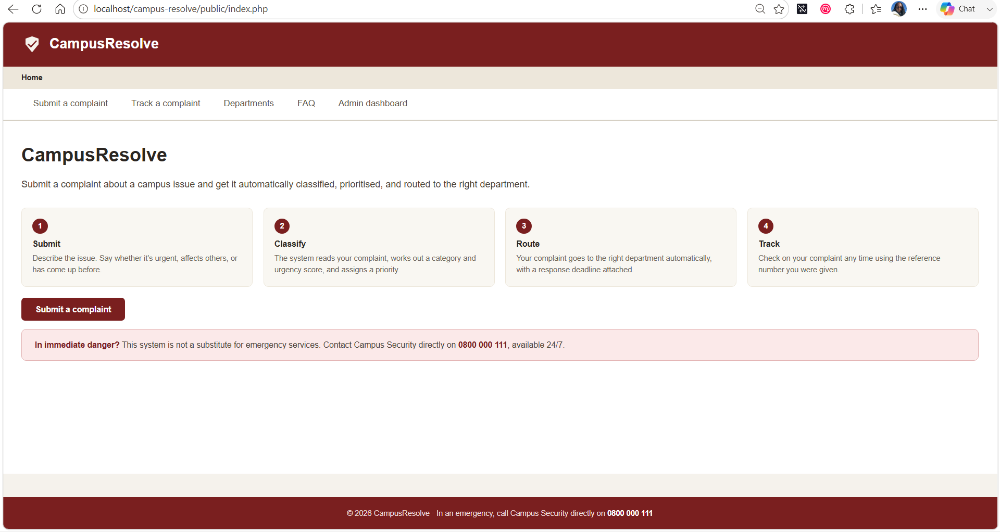
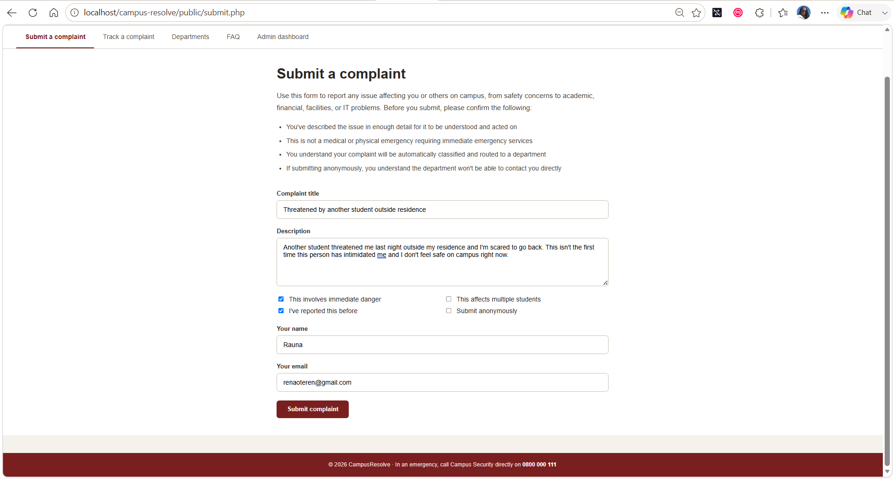
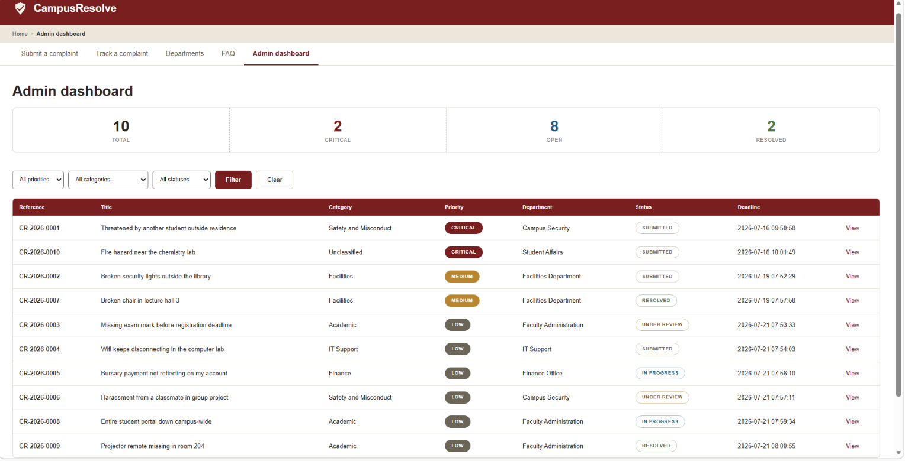
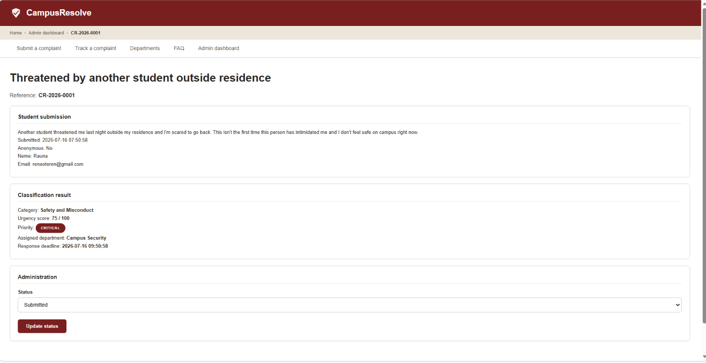
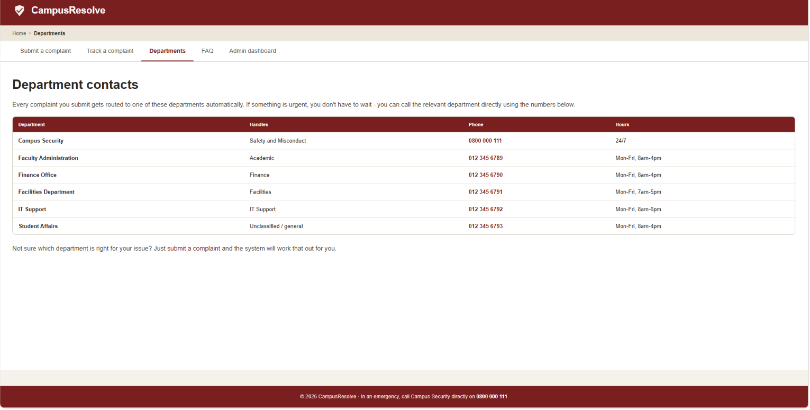
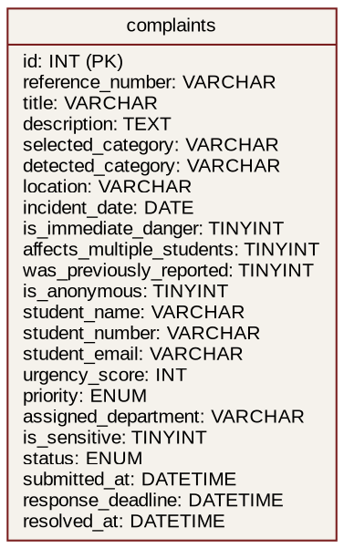

# CampusResolve

A web app for submitting and tracking campus complaints, built with PHP and MySQL. When a complaint comes in, it automatically works out how urgent it is, picks a category, and routes it to the right department - no manual sorting needed.

## Why I made this

Universities get all kinds of complaints - broken lights, missing marks, harassment, wifi issues - and they're not equally urgent. A safety complaint shouldn't wait behind a broken chair. I wanted something that actually thinks about a complaint instead of just storing it.

## What it does

Students submit a complaint, optionally staying anonymous, and get a reference number to track it later. There's also a page with department contact numbers for anyone who'd rather just call.

The system scans the complaint text for keywords to guess a category (Safety and Misconduct, Academic, Finance, Facilities, or IT Support), scores urgency out of 100, and assigns a priority from Low to Critical. It routes the complaint to the matching department and sets a response deadline based on priority. Checking "immediate danger" always forces Critical, no matter what the score comes out to.

Admins see every complaint sorted by priority, can filter by category or status, open a complaint to see the full breakdown, and update its status as it's handled.

## Screenshots

**Home page**

**Submitting a complaint**

**Admin dashboard**

**Complaint details**

**Department contacts**

## Diagrams

**Use case diagram**

.png)

**Database structure**

User stories are in docs/user-stories.md.

## How the classification works

Complaint text gets checked against keyword lists for five categories - whichever has the most matches wins, or it's marked "Unclassified" if nothing matches. Urgency adds points for safety words, time pressure words, multiple students affected, and prior reports. "Immediate danger" adds 40 points and forces Critical priority directly, so a real emergency never gets undersold. Department routing is just a straight map from category to department. The core logic lives in includes/functions.php if you want to see the classification engine directly.

## Known limitations

Keyword matching has real limits I found while testing. A missing projector remote got classified as Academic instead of Facilities, because "lecture room" matched but "projector" wasn't in any list. A wifi/assignment complaint tied between two categories and landed in the wrong one. Most notably, a fire hazard complaint scored Critical correctly but got categorized as Academic because it mentioned a "lecturer" - the urgency was right, the category wasn't. Keyword matching only catches words you thought to include; a real version would need a much bigger keyword set or actual NLP.

## Tech stack

PHP, MySQL, HTML/CSS. Runs locally through XAMPP.

## Running it locally

Prerequisites: XAMPP installed (https://www.apachefriends.org/), with Apache and MySQL enabled.

Clone the repo into your XAMPP htdocs folder:

cd C:\xampp\htdocs
git clone https://github.com/renaote/campus-resolve.git

Start Apache and MySQL in the XAMPP Control Panel. Open http://localhost/phpmyadmin, create a database called campus_resolve, and run the SQL in database/schema.sql. Then visit http://localhost/campus-resolve/public/index.php.

If the URL doesn't work, make sure the folder is named campus-resolve - that name has to match the URL path.

## Things I'd add

Real authentication instead of an open admin dashboard.
Export to CSV. Email notifications on status change.
 A better classification approach with more keywords or actual NLP.

## Author

Renate